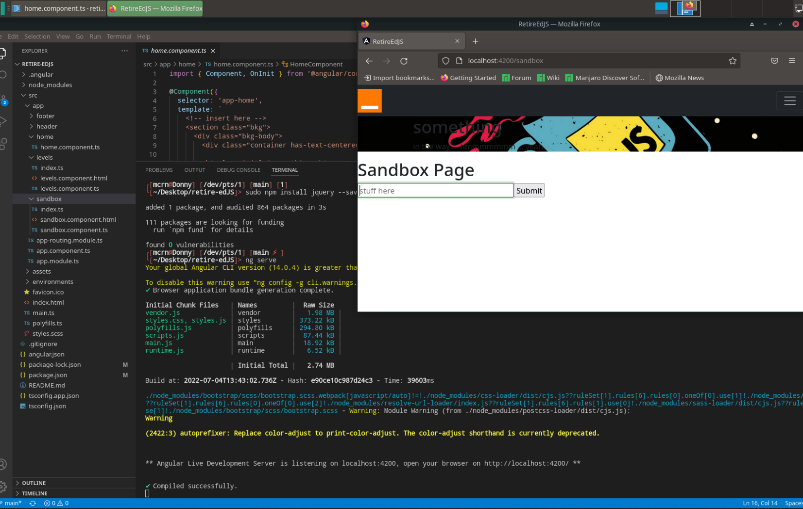

# RetireEdJS
 
### Flexible Angular lab to test JavaScript Related Vulnerabilities in-depth.  

---


### This is an Angular application that is meant for Single Page Applications(SPA). Although this not the latest and greatest it is still used alot in Web Applications 

---

# Context? What is this?

This is a Angular applications that bends to your will. It has some *weird* app routing methods to no longer make this a SPA. As of now, it, does not have any javascript libraries or makes use of anything external(With the exception of bootstrap being included within the application). It has a few pages with minimal code examples. 

Angular and node module folders are missing, which will not allow the application to run. These folders hold the dependencies of the applications. 

---

# Why is this a Things? Why are dependencies missing?

With this applications essentially *naked*, what can be done? Well, anything you choose I guess. I made it to test outdated JavaScript Library vulnerbilities and to do so you need to interchange between alot of JS libraries and other software versions.

Thats why the dependancies are missing; for you to spesify what you want this application to make use of. There are a vary of different methods to include software and their versions and I will discuss most of them..I think.

This wouldn't be a good lab if there was a button to press to change software versions; by understanding what happens beneath the application will give you more insight on why these vulnerabilities occur. 

---

# How do I make this lab my own?

This project was generated with [Angular CLI](https://github.com/angular/angular-cli) version 13.3.7.

Spesify what you need to determine what software versions you need running. As an example:
```
npm install -g @angular/cli@13.3.7.
npm install
npm install jquery@1.8.3 --save
npm install jquery-ui@latest 
etc...
```
Run the application with either of these commands then navigate to `http://localhost:4200/`
```
ng serve
npm start
```
The application will automatically reload if you change any of the source files.

---



---

# Interchanging methods

There are a few methods to change which software versions you want to make use of, which I believe is all part of the game. To understand if different methods of specifying software versions will result in different exploits. 

___


* To change the software versions without removing from dependecies with: 
```
npm uninstall [<@scope>/]<pkg>[@<version>]
```
; you can download another version of the software you need and specify its path in the `angular.json` file, under `scripts`, eg: 
```
 "scripts": [
   "./node_modules/jquery/dist/jquery.min.js"
      ]
```

___


* In Addition, some methods could allow for easier JS Library interchanging like using code such as:
```
<script src="https://code.jquery.com/jquery-3.5.1.min.js"></script>
```
Instead of changing Angular's JS Library file.

___

* Lastly, you could go to the `package.json` file and change the `dependancies`, eg:
```
"dependencies": {
    "jquery": "2.1.1"
}
```
Then running:
```
npm update
```
---

### There you have it. I starting point to begin understanding how vulnerabilities occur by seeing how the application reacts to different methods of exploits. Nobody will know your application as well as yourself and this forces you to understand how the application works by adding to it.


